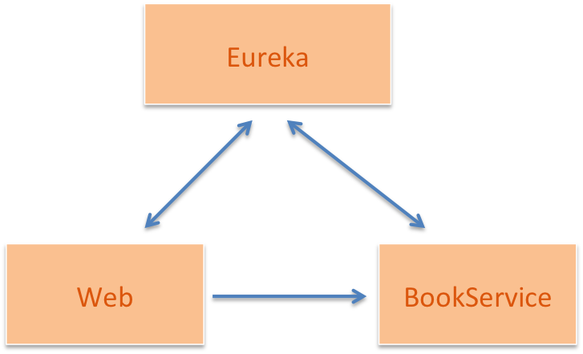
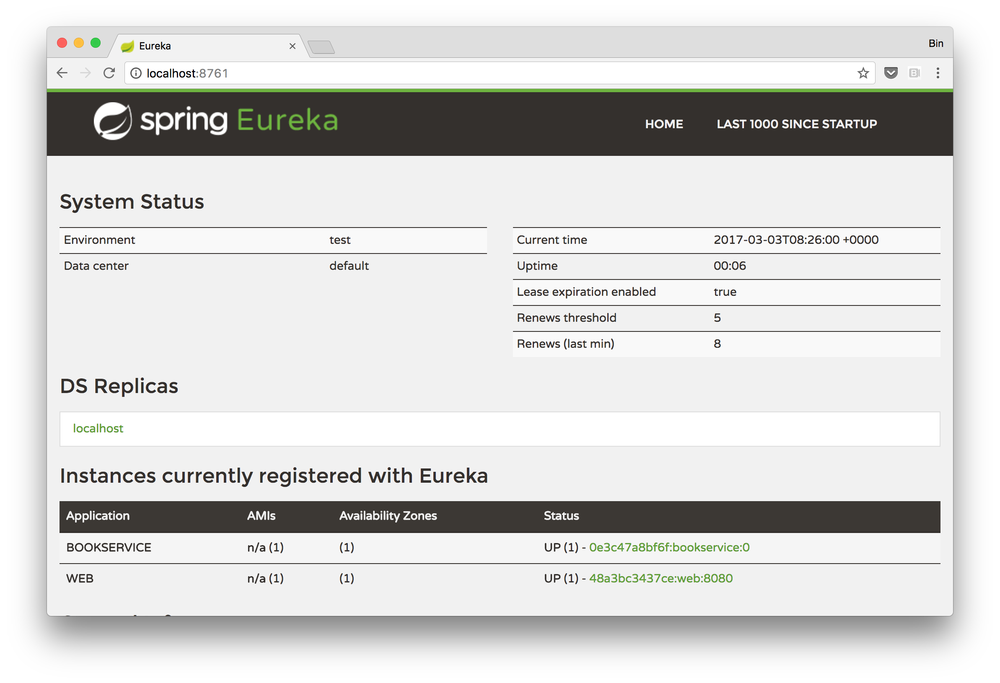
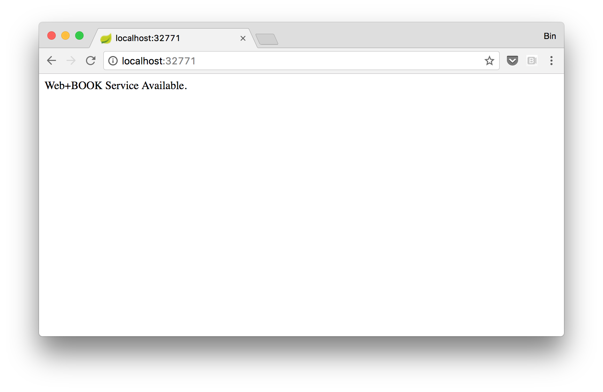
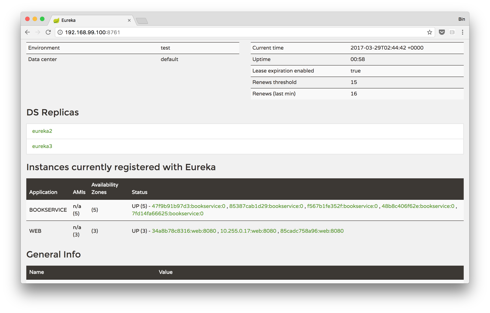

# Spring Cloud Demo on Docker


# Spring Cloud application

Demo application is a tiny Spring Cloud application which has three services. ```Web``` and ```BookService```will register itself to ```Eureka``` Service during boot. ```Web``` service depends on ```BookService```, when it is invoked, it will find available instances of ```BookService``` from ```Eureka``` Server. ```Web``` will call ```BookService``` REST API to fulfill its result. 





## Build


Run this command to build all images, it will rebuild all images even if no code change.

```
./build-all.sh
```


## Run application in local environment


Run demo application in local environment is wasy, there is an all-in-one compose file which allows you to run all the services. 

```
cd compose
docker-compose -f all-in-one.yml up -d
```


Find which port mapping for each services.

```
$ docker-compose -f all-in-one.yaml ps
        Name                       Command               State            Ports
----------------------------------------------------------------------------------------
compose_bookservice_1   java -Djava.security.egd=f ...   Up
compose_eureka_1        java -Djava.security.egd=f ...   Up      0.0.0.0:8761->8761/tcp
compose_web_1           java -Djava.security.egd=f ...   Up      0.0.0.0:32771->8080/tcp
```


You will see eureka maps to port 8761 of localhost while web maps to 32771 in this case.


## Access Eureka Server


Access Eureka server through port 8761. You will see this Eureka server has one replica and two services registered. 

```
http://localhost:8761
```



## Access the demo application

Docker allocated an random port for ```web``` service, you can get the port number using ```docker-compose ps``` command, or you can assign a port number in ```all-in-one.yml```.

Run this command or access it using a web browser.

```
curl http://localhost:<port>
```



## Deploy to docker swarm using compose V3 template

Let's take a look at [compose/all-in-one.yml](compose/all-in-one.yml). There are no version 3 specific compose syntax, you can deploy the application by using docker-compose in local environment, or deploy it to a Docker swarm cluster directly. 

```yaml
version: '3'
services:
  eureka:
    image: binblee/demo-eurekaserver
    ports:
      - "8761:8761"
    ...

  web:
    image: binblee/demo-web
    environment:
      - EUREKA_SERVER_ADDRESS=eureka
    ports:
      - "8080"
    ...

  bookservice:
    image: binblee/demo-bookservice
    environment:
      - EUREKA_SERVER_ADDRESS=eureka
    ...
```


You can deploy it to a docker swarm cluster like this:

```
docker stack deploy -f all-in-one.yml springcloud-demo
```


## Run in production environment

All in one is good, but you need to consider below factors when you want to run all the services in an production environment.

- deploy Eureka server and applications separately, as Eureka server as an infrasturcture level service will not be updated frequently, it is not proper to deploy it with applications every time the application changes.
- again, Eureka server as infrastructure level need some kind of HA (high availablity).


Let's break the deployment into two compose files. Using [eureka.yml](compose/eureka.yml) you can deply a three-node-cluster of Euerka. All instances have same network alias ```eureka``` for which Eureka client will looking for.  

[eureka.yml](compose/eureka.yml)

```yaml
version: '3'
services:
  eureka1:
    image: binblee/demo-eurekaserver
    networks:
      springcloud-overlay:
        aliases:
          - eureka
    ports:
      - "8761:8761"
    environment:
      - ADDITIONAL_EUREKA_SERVER_LIST=http://eureka2:8761/eureka/,http://eureka3:8761/eureka/
    ...
  eureka2:
    image: binblee/demo-eurekaserver
    networks:
      springcloud-overlay:
        aliases:
          - eureka
    ports:
      - "8762:8761"
    environment:
      - ADDITIONAL_EUREKA_SERVER_LIST=http://eureka1:8761/eureka/,http://eureka3:8761/eureka/
    ...
  eureka3:
    image: binblee/demo-eurekaserver
    networks:
      springcloud-overlay:
        aliases:
          - eureka
    ports:
      - "8763:8761"
    environment:
      - ADDITIONAL_EUREKA_SERVER_LIST=http://eureka1:8761/eureka/,http://eureka3:8761/eureka/
    ...
networks:
  springcloud-overlay:
    external:
      name: springcloud-overlay
```


[demoweb.yml](compose/demoweb.yml) gets the content from original [all-in-one.yml](compose/all-in-one.yml), adding network properties. All services will connect to ```springcloud-overlay``` network.

```yaml
version: '3'
services:
  web:
    image: binblee/demo-web
    networks:
      - springcloud-overlay
    environment:
      - EUREKA_SERVER_ADDRESS=eureka
    ports:
      - "8080"
    ...

  bookservice:
    image: binblee/demo-bookservice
    networks:
      - springcloud-overlay
    environment:
      - EUREKA_SERVER_ADDRESS=eureka
    ...

networks:
  springcloud-overlay:
    external:
      name: springcloud-overlay
```


Let's deploy it, noted that ```springcloud-overlay``` network needs to be created before ```eureka``` and ```demoweb``` are deployed.

```bash
docker network create -d overlay springcloud-overlay
cd compose/
docker stack deploy -c eureka.yml
docker stack deploy -c demoweb.yml
```


Access port 8761 of any node in swarm, you will see Eureka instance #1 has two replicas, and services are registered to it. Visit port 8761 and 8763, you will get other two Eureka server, have a try.



## Recap

